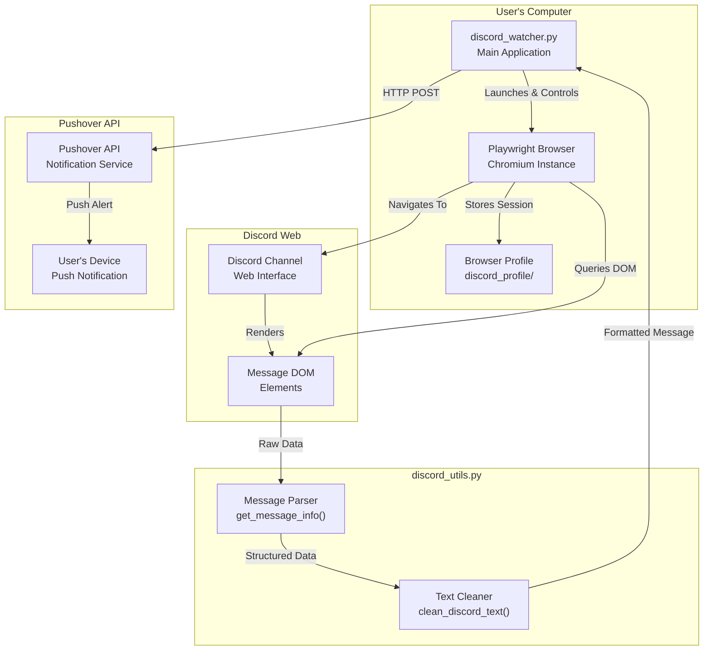
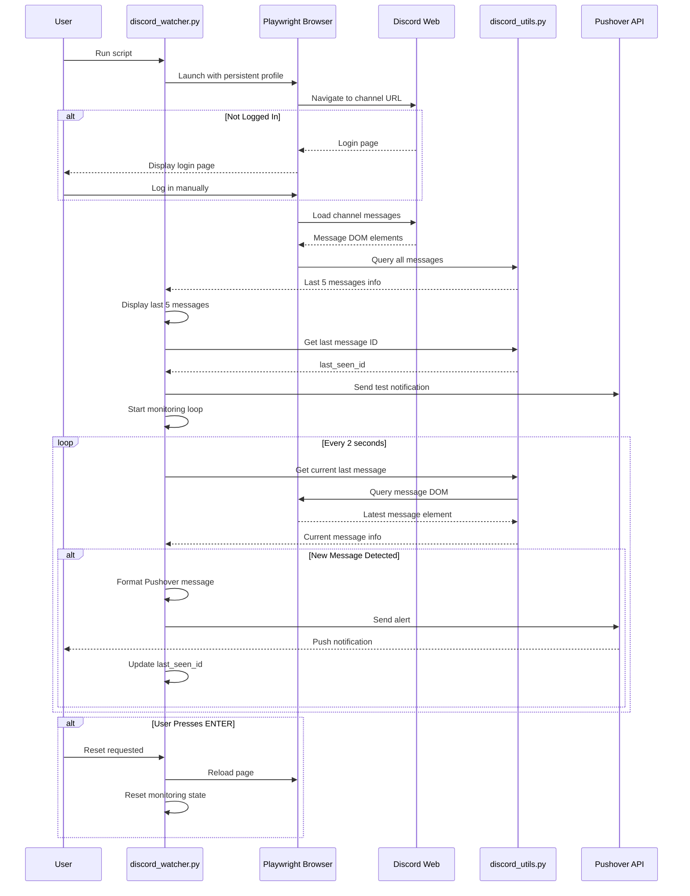

# How the Pokemon TCG Discord Alerts App Works

## Introduction

This application is a Discord channel monitoring tool that watches specific Discord channels for new messages and sends instant push notifications via Pushover when new content is detected. It's designed for users who want to be alerted about time-sensitive information (like Pokemon TCG product drops) without constantly checking Discord manually.

### Key Features

- **24/7 Monitoring**: Continuously watches Discord channels for new messages
- **Instant Alerts**: Sends push notifications within seconds of new message detection
- **Smart Content Extraction**: Identifies and extracts URLs, embed titles, images, and message text
- **Persistent Sessions**: Uses browser profiles to maintain Discord login sessions
- **Selective Monitoring**: Only alerts for messages with actual content (text, images, or embeds)
- **Manual Reset**: Allows users to reset monitoring state by pressing ENTER

## Architecture

The application uses a browser automation approach to interact with Discord, avoiding the need for Discord bot permissions or API access. This makes it work with private servers and paid Discord communities.

### System Architecture



### Technology Stack

- **Python 3**: Core programming language
- **Playwright**: Browser automation framework for interacting with Discord's web interface
- **Pushover API**: Push notification service for delivering alerts
- **Threading**: For handling user input while monitoring

## How It Works

### Application Flow

The application follows this high-level flow:

1. **Initialization**: Launch browser with persistent profile
2. **Authentication**: Navigate to Discord channel (uses saved session or prompts for login)
3. **Baseline Setup**: Display last 5 messages and identify the latest message ID
4. **Monitoring Loop**: Continuously check for new messages by comparing message IDs
5. **Alert Generation**: When new message detected, extract content and send Pushover notification
6. **Reset Capability**: User can reset monitoring state at any time

### Detailed Execution Flow



### Message Detection Mechanism

The application uses a simple but effective ID-based tracking system:

1. **Message ID Format**: Discord messages have IDs like `chat-messages-{channel_id}-{message_id}`
2. **Baseline**: On startup, the app records the ID of the newest message
3. **Comparison**: Every 2 seconds, it checks if the current newest message ID differs from the last seen ID
4. **New Message**: If IDs differ, a new message has been posted
5. **Content Filtering**: Only sends alerts for messages with actual content (text, images, or embeds)

### Alert Generation Process

When a new message is detected:

1. **Extract Message Data**: Parse the DOM to get text, URLs, embed titles, images
2. **Clean Content**: Remove Discord UI elements and format text
3. **Format Alert**: Structure message with:
   - Server and channel name
   - Embed title (if present) or message text
   - URL (if present)
   - Discord message link
4. **Send Notification**: POST to Pushover API with formatted message
5. **Update State**: Record new message ID as last seen

## Components

### discord_watcher.py

The main application file containing the core monitoring logic.

#### Key Functions

**`main(channel_url, profile_dir)`**
- Entry point for the application
- Initializes Playwright browser with persistent context
- Handles Discord login (manual if needed)
- Sets up initial monitoring state
- Starts the monitoring loop
- Handles user input for reset functionality

**`reset_monitoring(page, channel_url)`**
- Reloads the Discord channel page
- Displays the last 5 messages again
- Resets the `last_seen_id` to the newest message
- Sends a test notification
- Returns the new baseline message ID

**`format_pushover_message(msg_info, server_name, channel_name, channel_url)`**
- Formats message data into a readable Pushover notification
- Includes server name, channel name, embed title/text, URL, and Discord message link
- Handles missing data gracefully

**`send_pushover_alert(message)`**
- Sends formatted message to Pushover API via curl
- Uses high priority (priority 2) with persistent sound
- Includes retry and expiration settings
- Handles API response and errors

**`get_channel_name_from_url(url)`**
- Extracts channel name from Discord URL
- Falls back to hardcoded channel names based on channel ID
- Returns default "Discord" if unknown

**`get_server_name(page)`**
- Extracts server/guild name from Discord page title
- Parses title format: "Discord | #channel-name | Server Name"
- Returns None if server name not available

### discord_utils.py

Utility functions for parsing and processing Discord messages.

#### Key Functions

**`get_message_info(msg_element)`**
- Extracts comprehensive information from a Discord message DOM element
- Returns dictionary with:
  - `id`: Message ID
  - `text`: Message text content (cleaned)
  - `has_image`: Boolean indicating if message contains images
  - `has_embed`: Boolean indicating if message has embed/link preview
  - `embed_text`: Title text from embed (if present)
  - `url`: URL extracted from message (longest/most complete)
- Uses multiple DOM selectors to find content, embeds, and links
- Handles edge cases like author text in content area

**`clean_discord_text(text)`**
- Removes Discord UI elements from text
- Keeps only first 10 non-empty lines
- Strips whitespace
- Returns cleaned text string

**`get_last_message_info(page, debug=False)`**
- Gets information about the newest message in the channel
- Queries all messages and returns info for the last one
- Optional debug mode prints DOM structure
- Returns None if no messages found

**`debug_message_structure(msg_element)`**
- Debug utility to print detailed DOM structure
- Shows message ID, classes, child elements, author, content, timestamps, embeds, links
- Useful for troubleshooting Discord UI changes

#### Constants

**`MESSAGE_SELECTOR`**
- CSS selector for Discord message elements: `[id^="chat-messages-"]`
- Used to query all messages in a channel

## Configuration

### Command-Line Arguments

The application accepts the following command-line arguments:

- `--channel` or `-c`: Discord channel URL to monitor
  - Example: `python discord_watcher.py --channel "https://discord.com/channels/123/456"`
- `--profile` or `-p`: Browser profile directory path
  - Example: `python discord_watcher.py --profile "./my_profile"`

### Environment Variables

- `DISCORD_CHANNEL_URL`: Default channel URL if not provided via command line
- `DISCORD_PROFILE_DIR`: Default profile directory if not provided via command line

### Default Values

Defined in `discord_watcher.py`:

```python
DEFAULT_CHANNEL_URL = "https://discord.com/channels/1359582105591353376/1373855048190394428"  # Pokemon Center
DEFAULT_PROFILE_DIR = "./discord_profile"
```

### Browser Profile Management

- **Location**: Stored in `./discord_profile` by default (or custom path)
- **Purpose**: Maintains Discord login session across restarts
- **Benefits**: User only needs to log in once
- **Note**: Profile directory is created automatically by Playwright

### Pushover Configuration

Pushover credentials are currently hardcoded in `send_pushover_alert()`:

- **Token**: `a79nbse49c1qhzi3be8wuay79ma8u7` (application token)
- **User**: `uhk4gq35qtas36ynab7exwx119ekup` (user key)

**Note**: For production use, these should be moved to environment variables or a config file.

### Notification Settings

Pushover notifications are sent with:
- **Priority**: 2 (high priority - bypasses quiet hours)
- **Sound**: "persistent" (repeating notification sound)
- **Retry**: 30 seconds (retry interval if device is offline)
- **Expire**: 1800 seconds (30 minutes - notification expires if not delivered)

## Usage

### Basic Usage

1. **Install Dependencies**:
   ```bash
   pip install -r requirements.txt
   playwright install
   ```

2. **Run the Application**:
   ```bash
   python discord_watcher.py
   ```

3. **First Run**:
   - Browser window opens
   - If not logged in, log in to Discord manually
   - Press ENTER in terminal to continue
   - App displays last 5 messages and starts monitoring

4. **During Monitoring**:
   - App checks for new messages every 2 seconds
   - New messages trigger Pushover notifications
   - Press ENTER at any time to reset monitoring state

5. **Stop Monitoring**:
   - Press Ctrl+C in terminal
   - Browser window closes automatically

### Advanced Usage

**Monitor Different Channel**:
```bash
python discord_watcher.py --channel "https://discord.com/channels/SERVER_ID/CHANNEL_ID"
```

**Use Custom Profile**:
```bash
python discord_watcher.py --profile "./profile_1"
```

**Combine Options**:
```bash
python discord_watcher.py --channel "https://discord.com/channels/123/456" --profile "./my_profile"
```

### Monitoring Multiple Channels

To monitor multiple channels simultaneously:

1. Run multiple instances of the script
2. Use different profile directories for each instance
3. Specify different channel URLs

Example:
```bash
# Terminal 1
python discord_watcher.py --channel "https://discord.com/channels/123/456" --profile "./profile_1"

# Terminal 2
python discord_watcher.py --channel "https://discord.com/channels/123/789" --profile "./profile_2"
```

## Data Structures

### Message Information Dictionary

Returned by `get_message_info()`:

```python
{
    "id": str,              # Message ID like "chat-messages-{channel_id}-{message_id}"
    "text": str,            # Message text content (cleaned, max 10 lines)
    "has_image": bool,      # True if message contains images
    "has_embed": bool,      # True if message has embed/link preview
    "embed_text": str,      # Title text from embed (empty if no embed)
    "url": str              # URL extracted from message (longest one found)
}
```

### Pushover Message Format

The formatted message sent to Pushover:

```
Alert from {Server Name} in {Channel Name}

{Embed Title or Message Text}

Link: {URL if present}

Message: {Message Text if present}

Discord Message: {Direct link to Discord message}
```

### Channel URL Format

Discord channel URLs follow this pattern:
```
https://discord.com/channels/{server_id}/{channel_id}
```

Example:
```
https://discord.com/channels/1359582105591353376/1373855048190394428
```

## Technical Details

### Discord DOM Parsing Strategy

The application uses a multi-selector approach to find message content:

1. **Message Elements**: `[id^="chat-messages-"]` - Each message row
2. **Content Area**: Multiple selectors tried in order:
   - `[class*="messageContent"]`
   - `[class*="message-content"]`
   - `[class*="markup"]`
   - `[id*="message-content"]`
3. **Embed Detection**: Multiple selectors:
   - `[class*="embedWrapper"]`
   - `[class*="embedTitle"]`
   - `[class*="embed"]`
   - `[class*="linkPreview"]`
4. **Image Detection**: `img[src*="cdn.discordapp.com/attachments"]` or `img[src*="media.discordapp.net"]`
5. **URL Extraction**: Finds all `<a href>` elements and selects the longest URL

### Message Detection Mechanism

**ID-Based Tracking**:
- Each Discord message has a unique ID attribute
- Format: `chat-messages-{channel_id}-{message_id}`
- The app tracks the ID of the last seen message
- New messages have different IDs, triggering alerts

**Polling Interval**:
- Checks for new messages every 2 seconds
- Balance between responsiveness and resource usage
- Can be adjusted in the `time.sleep(2)` call in the monitoring loop

### Error Handling

**Browser Errors**:
- If messages can't be found, waits and retries
- If page fails to load, user can manually refresh and press ENTER

**API Errors**:
- Pushover API errors are logged but don't stop monitoring
- Failed notifications are printed to console

**Network Errors**:
- Playwright handles network timeouts automatically
- If Discord is unreachable, the app will retry on next check

### Threading for Input Handling

The application uses a separate thread to handle user input:

```python
def input_listener():
    while True:
        try:
            input()  # Wait for ENTER
            reset_requested.set()
        except:
            break

input_thread = threading.Thread(target=input_listener, daemon=True)
input_thread.start()
```

This allows the monitoring loop to continue while waiting for user input. When ENTER is pressed, a flag is set that the main loop checks periodically.

### Content Filtering

The app only sends alerts for messages with actual content:

```python
if current["text"] or current["has_image"] or current["has_embed"]:
    # Send alert
```

This filters out:
- Empty messages
- System messages without visible content
- Messages that are just reactions or edits

### Text Cleaning Process

The `clean_discord_text()` function:
1. Splits text into lines
2. Filters out empty lines
3. Keeps only first 10 non-empty lines
4. Strips whitespace
5. Returns cleaned string

This prevents notifications from being cluttered with Discord UI elements or overly long messages.

### Embed Title Extraction

When a message contains an embed (link preview), the app:
1. Finds the embed wrapper element
2. Looks for an anchor tag with `embedTitleLink` class
3. Extracts the text from that anchor (the link title)
4. Uses this as the primary content for the alert

This ensures users see the most relevant information (e.g., "Pokemon TCG Scarlet & Violet 10.5 Unova Mini Tin") rather than just the URL.

### URL Selection Strategy

When multiple URLs are found in a message:
1. All URLs are collected from links, embeds, and message content
2. Duplicates are removed
3. URLs are sorted by length (longest first)
4. The longest URL is selected (most complete/descriptive)

This prioritizes full product URLs over short redirect links.

## Limitations & Considerations

### Discord UI Changes

- The app relies on Discord's DOM structure
- If Discord changes their HTML/CSS, selectors may break
- The multi-selector approach provides some resilience
- May require updates if Discord significantly changes their interface

### Rate Limiting

- Checks every 2 seconds (not aggressive)
- Uses browser automation (not API), so no API rate limits
- Discord may detect automation, but using a real browser profile helps

### Browser Resources

- Keeps a browser window open continuously
- Uses system resources (memory, CPU)
- Multiple instances = multiple browsers

### Privacy & Security

- Discord credentials stored in browser profile (local)
- Pushover credentials currently hardcoded (should be externalized)
- No data sent to third parties except Pushover API

### Single Channel Monitoring

- Each instance monitors one channel
- Multiple channels require multiple instances
- Could be enhanced to support multiple channels in one instance

## Future Enhancements

Potential improvements:
- Support multiple channels in single instance
- Configurable polling interval
- Multiple notification services (email, SMS, etc.)
- Message filtering/rules (keywords, users, etc.)
- Alert history and logging
- Web dashboard for configuration
- Scheduled monitoring (only during certain hours)
- Message content filtering (only alert for specific keywords)
